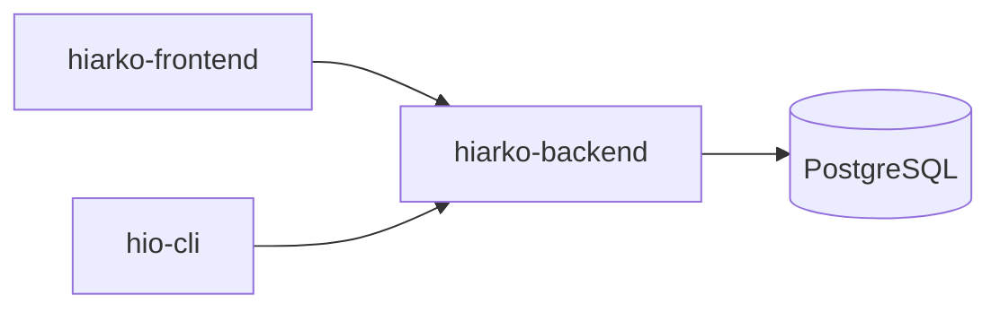

# Hiarko

Hiarko is a Kanban-style project management platform. It is composed of three independent repositories that together form a complete system — a REST API backend, a web frontend, and a terminal CLI, all sharing the same API contract.

---

## Demos

**Web app**

<video src="demos/demo_web.mp4" controls width="100%"></video>

**CLI**

<video src="demos/cli_web.mp4" controls width="100%"></video>

---

## Repositories

| Repository | Description |
|---|---|
| [hiarko-backend](https://github.com/vidareriksson/hiarko-backend) | REST API server — Node.js, Express, TypeScript, PostgreSQL, Prisma |
| [hiarko-frontend](https://github.com/vidareriksson/hiarko-frontend) | Web application — Svelte 5, Vite, Tailwind CSS 4 |
| [hio-cli](https://github.com/vidareriksson/hio-cli) | Terminal CLI (`hio` command) — TypeScript |

Each repository contains its own setup instructions, environment configuration, and development guide.

---

## Architecture

The backend exposes a single REST API that is consumed by both the frontend and the CLI. Any changes to API contracts must be reflected across all three repositories.

---

## Domain Model

- **Organizations** — top-level workspace, shared by a team
- **Boards** — project boards within an organization
- **Columns** — status columns within a board (e.g. To Do, In Progress, Done)
- **Tasks** — work items within columns, assignable and prioritizable
- **Views** — saved queries that filter and group tasks across boards org-wide

---

## Getting Started

1. Set up and run **hiarko-backend** first — see its README for environment variables and database migration steps.
2. Set up **hiarko-frontend** and point it at the running backend.
3. Set up **hio-cli** for terminal access. CLI credentials are stored at `~/.hio/config.json`.
